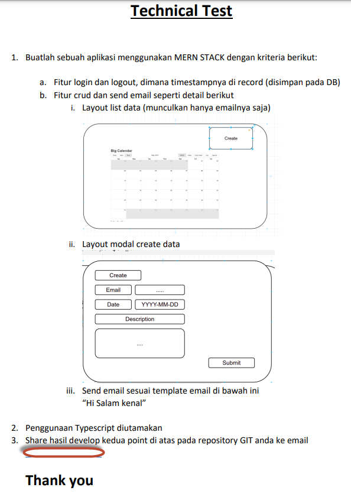

# Pengenalan

Ini adalah repository untuk tugas freelance remote.

# Cara Kerja

## Backend 
> $ npm run server

> Buka Browser ke url ```http://localhost:5001```

## Frontend

[TODO]

# Tugas



# Hasil